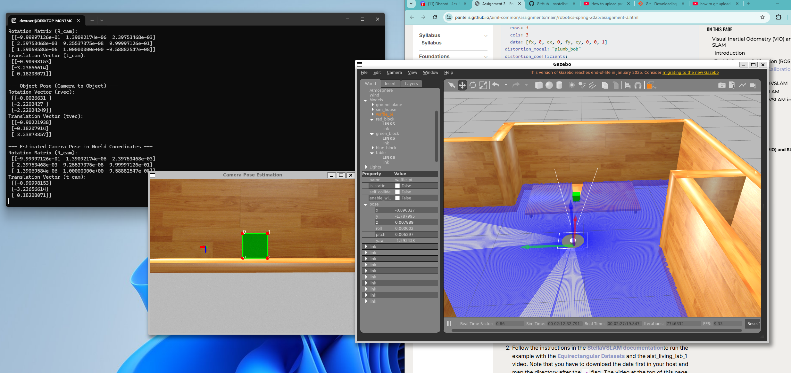

<h1>Assignment 3</h1>
<h2>Task 1: Camera Calibration (ROS)</h2>

<figure>
    <figcaption><strong>Capturing checkerboard using in ros2 and publishing as a topic</figcaption>
    
    
</figure>

<b> Step1: Download to task_1_camera_calibration_ROS.</b>
<b> Step2: source ros2 then run ros2_cam_strm_saver.py.</b>
<b> This python script will save camera frames from the stream to \``images\'' folder.</b>
<b> Step3: run camera_calibrate.py; it will calibrate the camera configuration from the \``images\'' in the images folder and save \``camera_config.yaml\'' file.</b>


<h2>Task 2: Apply Camera Calibration (ROS)</h2>

<figure>
    <figcaption><strong>Estimating camera position in the turtle bot meze environment</figcaption>
    
    
</figure>

<b> Step1: build the doceker in already cloned turtlebot3_behavior_demos. <br>docker compose build <br> run docker compose up demo-world <br>
run docker compose up dev<br>
run docker compose exec -it dev bash
</b> <br>
<b> go to src folder </b><br>
<b>Create a pkg <br> 
<br> ros2 pkg create --build-type ament_python ecp_pkg <br>
nano ecp_pkg/ecp_pkg/ecp.py<br>
In ecp.py python file paste the code in ecp.py from \``task_2_apply_camera_calibration_ROS\'' folder. <br>
Make the file executable <br>
chmod +x ecp_pkg/ecp_pkg/ecp.py <br>
Edit setup.py <br>
nano est_camPos_pkg/setup.py <br>
In setup.py python file paste the code in setup.py from \``task_2_apply_camera_calibration_ROS\'' folder. <br>
Build the package <br>
colcon build --packages-select ecp_pkg <br>
Run <br>
ros2 run ecp_pkg ecp


## Step 1: Build and Launch the Docker Environment

```bash
# In the cloned turtlebot3_behavior_demos directory:
docker compose build

# Launch the demo world:
docker compose up demo-world

# Launch the development container:
docker compose up dev

# Access the development container:
docker compose exec -it dev bash

# Navigate to the source folder:
cd src

# Create a new ROS2 Python package:
ros2 pkg create --build-type ament_python ecp_pkg

