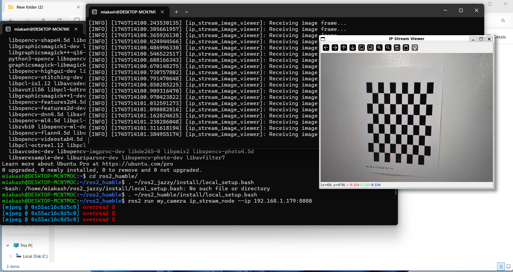

<h1>Assignment 3</h1>
<h2>Task 1: Camera Calibration (ROS)</h2>

<figure>
    <figcaption><strong>Capturing checkerboard using in ros2 and publishing as a topic</figcaption>
    
    
</figure>

<b> Step1: Download to task_1_camera_calibration_ROS.</b>
<b> Step2: source ros2 then run ros2_cam_strm_saver.py.</b>
<b> This python script will save camera frames from the stream to \``images\'' folder.</b>
<b> Step3: run camera_calibrate.py; it will calibrate the camera configuration from the \``images\'' in the images folder and save \``camera_config.yaml\'' file.</b>
